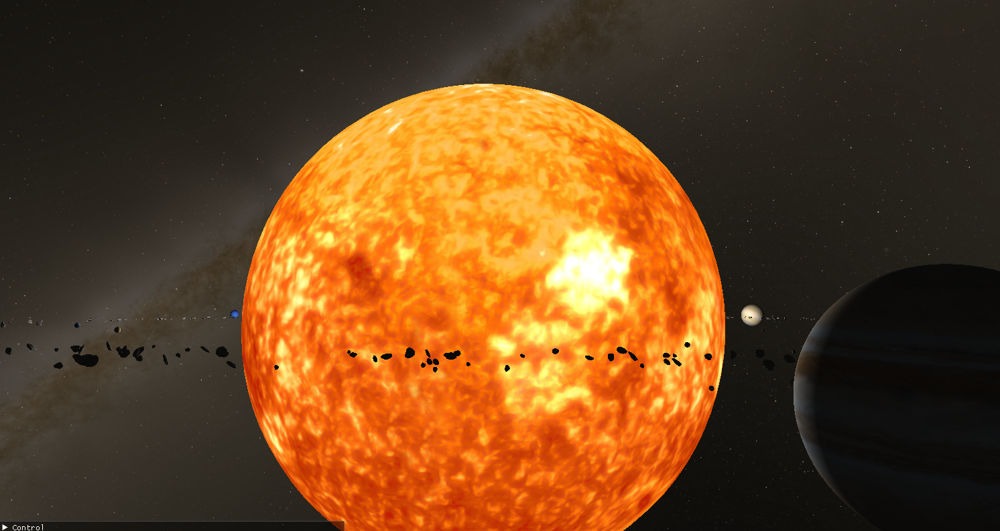

# Solar System Model

Implemented with C++17 in Visual Studio 19 using OpenGL library.

This model contains scale-accurate sun/planet/satellite models, an asteroid belt, etc.
Initially wanted to make distances accurate as well, however real astronomical distances are too vast.
So everything is much closer or it makes for a boring simulation

### Controls
- W/A/S/D or up/down/left/right keys to translate view.
- mouse scroll to move fowards or backwards
- mouse drag to rotate viewing angle
- collapsable user interface to toggle different display and simulation elements

### Screenshots

